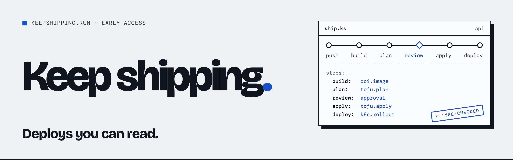

<p align="center">
  
</p>

<p align="center">
  
  
  
  
  
</p>

---

# The site

The marketing site for **Keep Shipping**: one typed, readable deploy workflow
per repo that builds images, plans and applies infrastructure, waits for a
human and deploys, the same on a laptop as in CI. One page, one stylesheet,
one small script, served by Cloudflare Pages at
[keepshipping.run](https://keepshipping.run). No framework, no bundler, no
build step. It was designed in Claude Design ("Keep Shipping") and ported
from its template to static HTML; layout and colour stay inline, as designed.

## The rule this site is built around

Keep Shipping is in development. So:

- The hero says **Early access · in development**.
- Workflow files, CLI output and timings on the page show the planned design.
  `llms.txt` says so in plain words.
- There is no signup backend yet. A valid email opens a prefilled mail to
  `contact@keepshipping.run` (Cloudflare Email Routing), and the status line
  says that. With JS off, the form's own `mailto:` action does the same.
- Links go to things that exist: "How it works" is section 02, GitHub is the
  organisation. There are no docs yet, so there is no docs link.

When something ships, change `index.html` and `llms.txt` together.

## The "Built with" strip

The footer lists what Keep Shipping is built with: the `uses` of FZ-012 in the
Factory Zero registry (`Factory-Zero/website`, `assets/fz-data.js`, published as
https://factory0.ventures/stack.json), each marked planned unless it is in use
today. `tools/built-with.json` is a vendored copy of that entry and
`tools/built-with.py` writes the strip between the `built-with` markers; the
page never fetches it. Change the registry first, then run
`python3 tools/built-with.py --pull`, and `--check` to see whether the page is
stale. `llms.txt` repeats the list; keep the two together.

## Files

| Path | What it is |
| :--- | :--- |
| `index.html` | The page: hero with `ship.ks`, 01 push and pray, 02 typed, 03 local = CI, 04 built in, 05 blocks, 06 escape hatch, 07 agents and Jev, 08 Cloudflare console (planned, Keep-Shipping/harness#166), 09 comparison, early access |
| `assets/keepshipping.css`, `assets/keepshipping.js` | Base styles, hover/focus states, the route animation; the form handler |
| `404.html` | Served for unknown paths, so they return 404 instead of the home page |
| `llms.txt`, `robots.txt`, `sitemap.xml` | Machine-readable summary (status, design, comparison), crawler rules, sitemap |
| `_headers`, `_redirects` | Security and cache headers; `/github` and `/source` short links |
| `.well-known/security.txt` | Where to report a vulnerability |

The head carries the canonical URL, Open Graph and Twitter tags, and JSON-LD
for `Organization`, `WebSite`, `SoftwareApplication` and a short `FAQPage`.

## Brand assets

| File | Use |
| :--- | :--- |
| `assets/favicon.svg` | The mark: a blue square with the pipeline line and the review diamond |
| `assets/logo-mark.svg` | The mark on a paper tile. Source for the app icons |
| `assets/icon-512.png`, `assets/apple-touch-icon.png` | App and home-screen icons |
| `assets/og.png` | Open Graph and Twitter card, 1200×630 |
| `assets/readme-banner.png`, `assets/org-avatar.png`, `assets/logo.png` | GitHub only: this README, the organisation profile, a transparent lockup. Not published on the site |

```sh
tools/render-og.sh   # headless Chrome; regenerates every PNG above from tools/*-render.html
```

Palette (from the design's OKLCH values): background `#EEF0F3`, paper
`#FBFCFD`, ink `#11161F`, blue `#1950CC`, muted `#3E434B`. Type: Bricolage
Grotesque (display and body) and DM Mono. Square corners, 1.5px ink borders,
one hard offset shadow on the hero file.

## Develop

```sh
python3 -m http.server 8787   # serve the repository root; there is nothing to build
```

## Deploy

Merging to `main` publishes nothing: the Pages project `keepshipping` is
direct-upload on the Factory0 Cloudflare account. Deploy with:

```sh
tools/deploy.sh             # builds origin/main in a throwaway worktree and deploys it
tools/deploy.sh --dry-run   # builds it and says what would ship
```

Never `build-dist.sh && wrangler pages deploy dist` from a working copy: more
than one agent session can share a checkout. `build-dist.sh` is an explicit
allowlist and stamps content hashes onto the CSS and JS URLs, which `_headers`
caches for a year. So don't request a new `/assets/*` URL on keepshipping.run
before its deploy finishes (Pages answers a missing asset with HTML, and the
edge keeps it); probe on `keepshipping.pages.dev` or add a `?cb=` query.

---

Keep Shipping is a venture of [Factory Zero](https://factory0.ventures/) (Factory Zero Pte. Ltd.).
